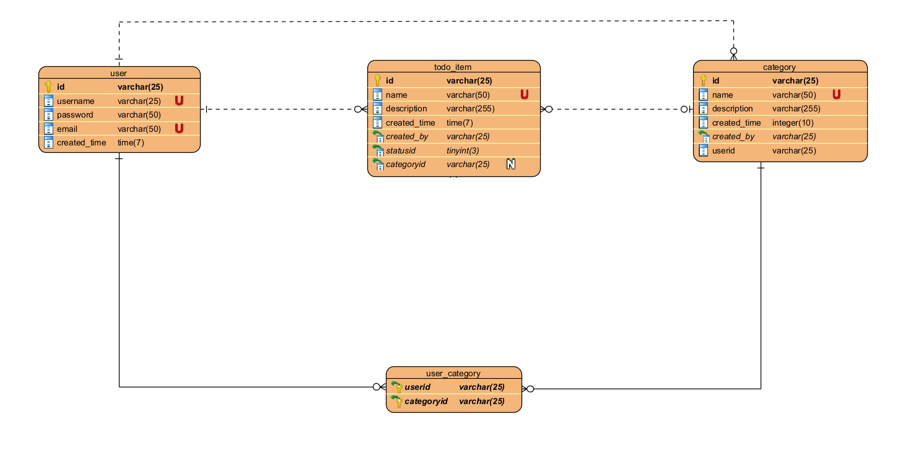

# FASTAPI WORK MANAGER

## GIỚI THIỆU
Dự án Ứng dụng Quản lý công việc sử dụng FastAPI và PostgreSQL

1. Các tính năng của ứng dụng

- Mục đích của dự án là để người dùng quản lý được các đầu công việc của họ
- User có thể CRUD các đầu công việc (todo-item) của mình
- User có thể chia các todo-item vào các category khác nhau
- User có thể add user vào category của mình, và các user trong category có thể Xem, Add thêm các todo-item, hoặc Update/ Delete các todo-item của mình.
- User có thể update trạng thái của todo-item (Todo-Processing-Done) 
- Vào cuối ngày (5h chiều hang ngày, sẽ gửi email đến cho user danh sách các công việc mà họ chưa hoàn thành, gồm các thông tin (tên category, tên công việc, thời gian còn lại) – nếu có)
- Khi có thay đổi trạng thái của todo-item, sẽ có notify đến cho các user thuộc category của todo-item đó.

2. Thiết kế database



## CÀI ĐẶT
Cài đặt môi trường ảo:
```
py -m venv .venv
```

kích hoạt môi trường ảo: 
```
.venv/scripts/activate
```

cài đặt packages:
```
pip install -r requirements.txt
```

lệnh migrate:
```
alembic upgrade head
```